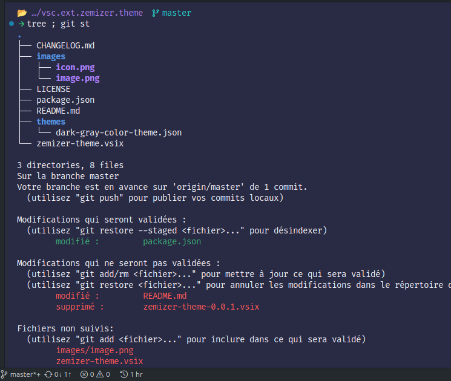

# ZeMizer Theme <!-- omit in toc -->

A ZeMizer theme for VS Code, based on the [GitHub Theme][1].

> [!NOTE]
> In the previous images, the font used is the [Nerd Font _Fira Code_](https://www.nerdfonts.com/font-downloads), and the terminal prompt is [_Starship_](https://starship.rs/).

## Table of Contents <!-- omit in toc -->

1. [Installation](#installation)
   1. [From the VS Code Marketplace](#from-the-vs-code-marketplace)
   2. [From a VSIX](#from-a-vsix)
2. [Features](#features)
3. [Credits](#credits)

## Installation

### From the VS Code Marketplace

1. Open the Extensions view by clicking on the Extensions icon in the Activity Bar on the side of the VS Code window, or with `Ctrl+X` or `Cmd+X`.
2. Search for `ZeMizer Theme`.
3. Click the Install button.

### From a VSIX

1. Download the `.vsix` file:
   - from the Microsoft VS Code Marketplace: [ZeMizer Theme](https://marketplace.visualstudio.com/items?itemName=Kmzx.zemizer-theme)
   - the last development version: [zemizer-theme.vsix](zemizer-theme.vsix)
2. Open the panel with `Ctrl+P` or `Cmd+P`.
3. Type `Install from VSIX` and press `Enter`.
4. Select the `.vsix` file and press `Enter`.

## Features

- `ZeMizer Dark Gray` : a dark theme
  - **editor**: focus on gray and blue colors (based on `GitHub Dark` theme from [GitHub Theme][1]).
  - **terminal**: focus on purple, green & cyan colors.

## Credits

- icon: Made on [Canva](https://www.canva.com/)
- theme: [GitHub Theme][1]

[1]: https://github.com/primer/github-vscode-theme
