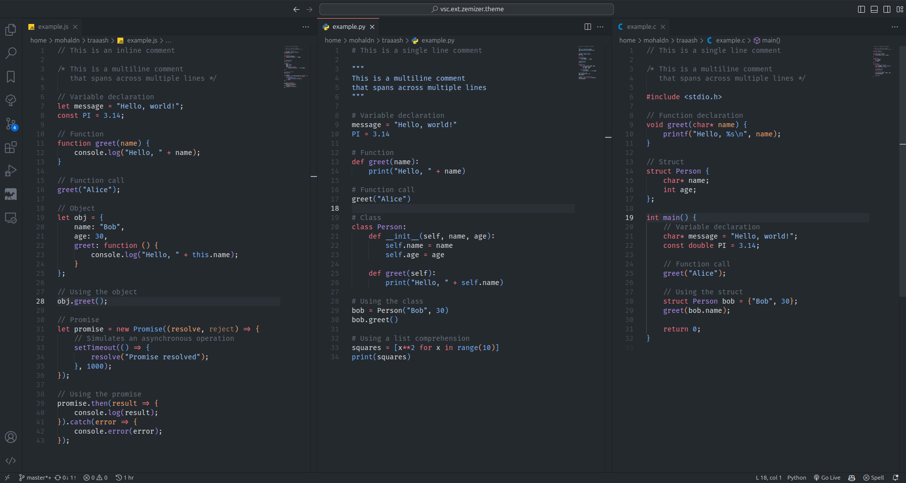

# ZeMizer Theme <!-- omit in toc -->

A ZeMizer theme for VS Code, based on the [GitHub Theme][1].

> [!NOTE]
> In the previous images, the font used is the [Nerd Font _Fira Code_](https://www.nerdfonts.com/font-downloads), and the terminal prompt is [_Starship_](https://starship.rs/).

## Table of Contents <!-- omit in toc -->

1. [Installation](#installation)
2. [Features](#features)
3. [Credits](#credits)

## Installation

1. Open the panel with `Ctrl+P` or `Cmd+P`.
2. Type `Install from VSIX` and press `Enter`.
3. Select the [zemizer-theme.vsix](zemizer-theme.vsix) file.

## Features

- `ZeMizer Dark Gray` : a dark theme
  - editor: focus on gray and blue colors (based on `GitHub Dark` theme from [GitHub Theme][1]).
  - terminal: focus on purple, green cyan colors.

## Credits

- icon: [Discotools.xyz (discordicon.com)](https://www.discordicon.com/icons-editor)
- theme: [GitHub Theme][1]

[1]: https://github.com/primer/github-vscode-theme
